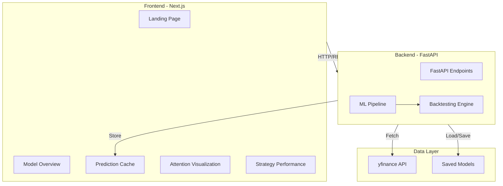

# Financial Forecasting Platform

A complete financial forecasting platform with attention-based LSTM models and asymmetric loss functions for directional prediction of major market indices.

## Overview

This platform provides:
- **Attention-based LSTM** models for predicting market direction
- **Asymmetric loss functions** that penalize missing upward moves more heavily
- **Walk-forward validation** for robust model training
- **Comprehensive backtesting** with transaction costs
- **Modern dashboard** for visualizing predictions, attention weights, and strategy performance

## Architecture



## Features

### Backend (ML + API)

- **Data Pipeline**: Fetches historical data for S&P 500, Dow Jones, and NASDAQ using yfinance
- **Feature Engineering**: Technical indicators (RSI, MACD, Bollinger Bands) and price/volume features
- **Attention LSTM**: Neural network with Bahdanau-style attention mechanism
- **Asymmetric Loss**: Directional loss with 2:1 penalty ratio (missing upward moves penalized more)
- **Walk-Forward Training**: 2-year training windows, 1-month test windows
- **Backtesting**: Long-only strategy with 0.1% transaction costs
- **Baseline Models**: Vanilla LSTM and ARIMA for comparison
- **FastAPI Endpoints**: 6 REST endpoints for metrics, predictions, equity curves, attention weights, and comparisons

### Frontend (Dashboard)

- **Landing Page**: Index selection and feature overview
- **Model Overview**: Performance metrics and baseline comparisons
- **Prediction Dashboard**: Price charts with actual vs predicted directions
- **Attention Visualization**: Heatmap showing which days the model focuses on
- **Strategy Performance**: Equity curves, drawdown charts, and performance statistics
- **Dark Mode**: Professional quant-style UI with dark theme

## Project Structure

```
lstm-stock-prediction/
├── backend/
│   ├── data/
│   │   ├── fetcher.py          # yfinance data fetching
│   │   └── preprocessor.py     # Data cleaning and normalization
│   ├── features/
│   │   └── indicators.py       # Technical indicators
│   ├── models/
│   │   ├── attention_lstm.py   # Attention-based LSTM
│   │   └── baseline_models.py  # Vanilla LSTM, ARIMA
│   ├── losses/
│   │   └── asymmetric.py       # Asymmetric loss function
│   ├── training/
│   │   ├── trainer.py          # Training utilities
│   │   └── walk_forward.py     # Walk-forward validation
│   ├── backtesting/
│   │   ├── strategy.py         # Long-only strategy
│   │   └── metrics.py          # Performance metrics
│   ├── api/
│   │   ├── models.py           # Pydantic schemas
│   │   └── routes.py           # FastAPI routes
│   ├── utils/
│   │   └── config.py           # Configuration
│   ├── main.py                 # FastAPI app
│   └── train_models.py          # Model training script
├── frontend/
│   ├── pages/                  # Next.js pages
│   ├── components/             # React components
│   ├── services/               # API client
│   ├── types/                  # TypeScript types
│   └── utils/                  # Utilities
└── requirements.txt            # Python dependencies
```

## Setup Instructions

### Prerequisites

- Python 3.8+
- Node.js 18+
- npm or yarn

### Backend Setup

1. Install Python dependencies:
```bash
pip install -r requirements.txt
```

2. Train models (this will take some time):
```bash
python backend/train_models.py
```

3. Start the FastAPI server:
```bash
uvicorn backend.main:app --reload
```

The API will be available at `http://localhost:8000`

### Frontend Setup

1. Navigate to frontend directory:
```bash
cd frontend
```

2. Install dependencies:
```bash
npm install
```

3. Start the development server:
```bash
npm run dev
```

The frontend will be available at `http://localhost:3000`

## API Endpoints

- `GET /api/indices` - List available indices
- `GET /api/metrics/{index}` - Get model performance metrics
- `GET /api/predictions/{index}` - Get recent predictions
- `GET /api/equity-curve/{index}` - Get equity curve data
- `GET /api/attention/{index}` - Get attention weights
- `GET /api/baseline-comparison/{index}` - Compare with baseline models

## Model Details

### Attention LSTM Architecture

- **Input**: 60-day sequences of engineered features
- **LSTM Layers**: 2 layers, 128 hidden units
- **Attention**: Bahdanau-style additive attention
- **Output**: Probability of upward movement (binary classification)

### Asymmetric Loss

The loss function applies different penalties:
- **Upward moves (target=1)**: Penalty = 2.0 × BCE loss
- **Downward moves (target=0)**: Penalty = 1.0 × BCE loss

This emphasizes catching upward movements, which is often more valuable in financial markets.

### Walk-Forward Training

- **Training Window**: 2 years
- **Test Window**: 1 month
- **Sliding**: Monthly forward progression
- Models are retrained for each window to avoid look-ahead bias

### Backtesting Strategy

- **Strategy**: Long-only (buy when predicted probability > 0.5)
- **Transaction Costs**: 0.1% per trade
- **Metrics Calculated**:
  - Cumulative returns (equity curve)
  - Sharpe ratio (annualized)
  - Maximum drawdown
  - Win rate

## Technical Decisions

1. **Asymmetric Loss**: Directional loss with 2:1 penalty ratio to emphasize upward moves
2. **Lookback Window**: 60 days for LSTM sequences
3. **Training Data**: 5 years of daily data
4. **Transaction Costs**: 0.1% per trade (realistic for retail trading)
5. **Model Persistence**: PyTorch `.pt` files for neural networks, pickle for baseline models

## Financial Reasoning

- **Directional Prediction**: Predicting direction (up/down) is more robust than predicting exact prices
- **Asymmetric Loss**: In financial markets, missing upward moves often has higher opportunity cost
- **Walk-Forward Validation**: Prevents overfitting and provides realistic performance estimates
- **Transaction Costs**: Essential for realistic backtesting results
- **Attention Mechanism**: Helps identify which historical periods are most relevant for predictions

## Notes

- Models are pre-trained before serving via API (faster inference)
- All predictions and metrics are cached for quick API responses
- The system is designed for research and educational purposes
- Past performance does not guarantee future results

## License

This project is for educational and research purposes.
